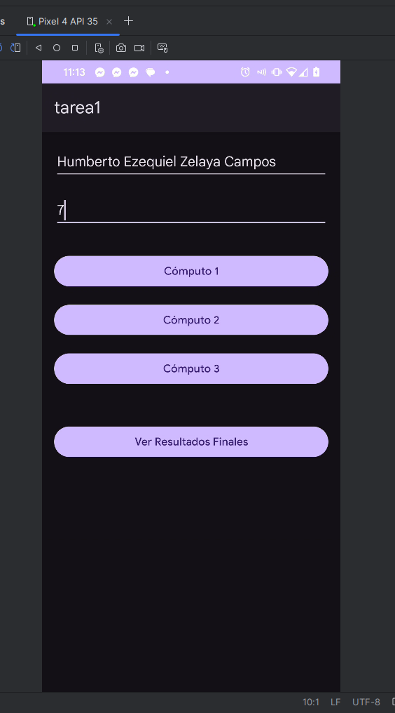
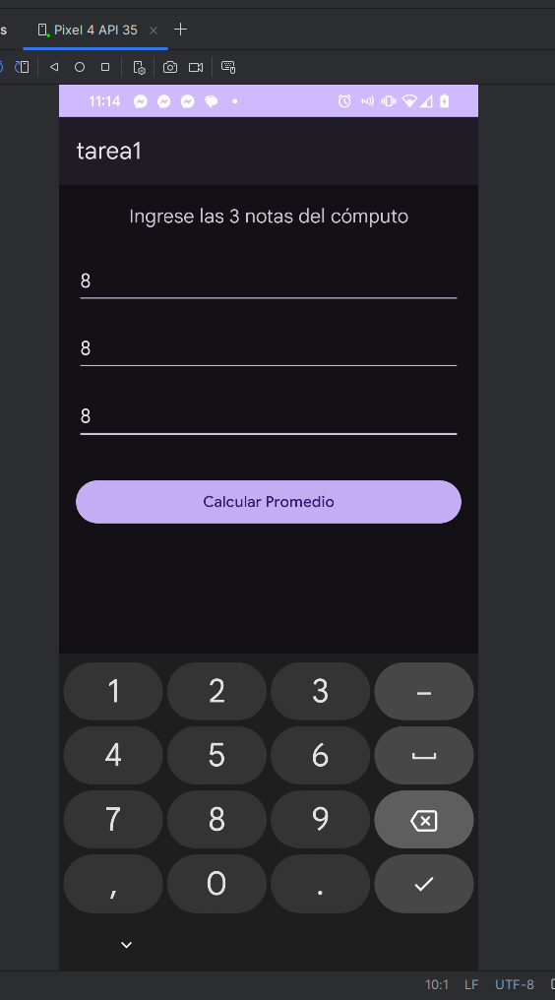
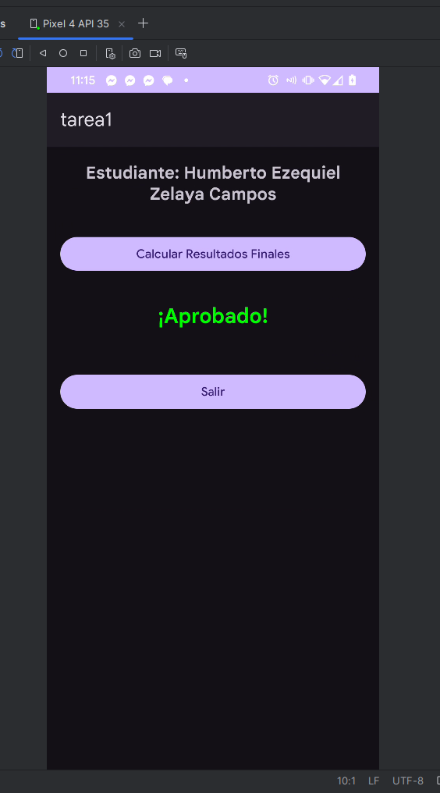

# Calculadora de Notas UNIVO

Aplicación Android para calcular promedios de tres cómputos y determinar si un estudiante aprueba.

## Funcionalidades
- Ingresar nombre del estudiante y nota mínima para aprobar.
- Calcular promedio por cada cómputo (3 notas por cómputo).
- Visualizar resultados finales con estado de aprobación y diferencia necesaria en caso de reprobar.

## Capturas de Pantalla
| Main Activity | Computo Activity | Results Activity |
|---------------|------------------|------------------|
|  |  |  |

## Repositorio
Enlace al repositorio: [github.com/EzequielMisterLinux/grade-point-average-calculator](https://github.com/EzequielMisterLinux/grade-point-average-calculator)

## Instalación
1. Clonar el repositorio.
2. Abrir en Android Studio.
3. Ejecutar en un emulador o dispositivo físico.